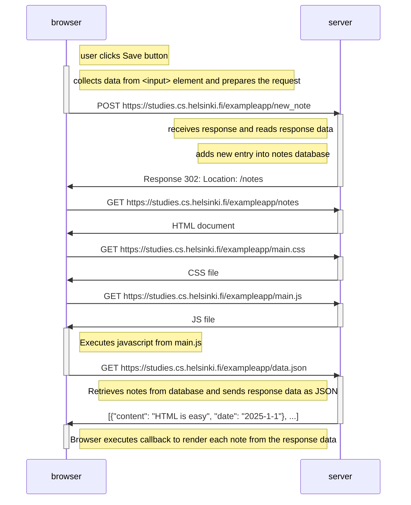

```mermaid

sequenceDiagram
    participant browser
    participant server

    Note right of browser: user clicks Save button

    activate browser
    Note right of browser: collects data from <input> element and prepares the request

    browser->>server: POST https://studies.cs.helsinki.fi/exampleapp/new_note
    deactivate browser

    activate server
    Note left of server: receives response and reads response data
    Note left of server: adds new entry into notes database
    server->>browser: Response 302: Location: /notes
    deactivate server
    
    browser->>server: GET https://studies.cs.helsinki.fi/exampleapp/notes
    activate server
    server->>browser: HTML document
    deactivate server

    browser->>server: GET https://studies.cs.helsinki.fi/exampleapp/main.css
    activate server
    server->>browser: CSS file
    deactivate server

    browser->>server: GET https://studies.cs.helsinki.fi/exampleapp/main.js
    activate server
    server->>browser: JS file
    deactivate server
    
    activate browser
    note right of browser: Executes javascript from main.js
    browser->>server: GET https://studies.cs.helsinki.fi/exampleapp/data.json
    deactivate browser

    activate server
    note left of server: Retrieves notes from database and sends response data as JSON
    server->>browser: [{"content": "HTML is easy", "date": "2025-1-1"}, ...]
    deactivate server

    activate browser
    note right of browser: Browser executes callback to render each note from the response data
    deactivate browser
```