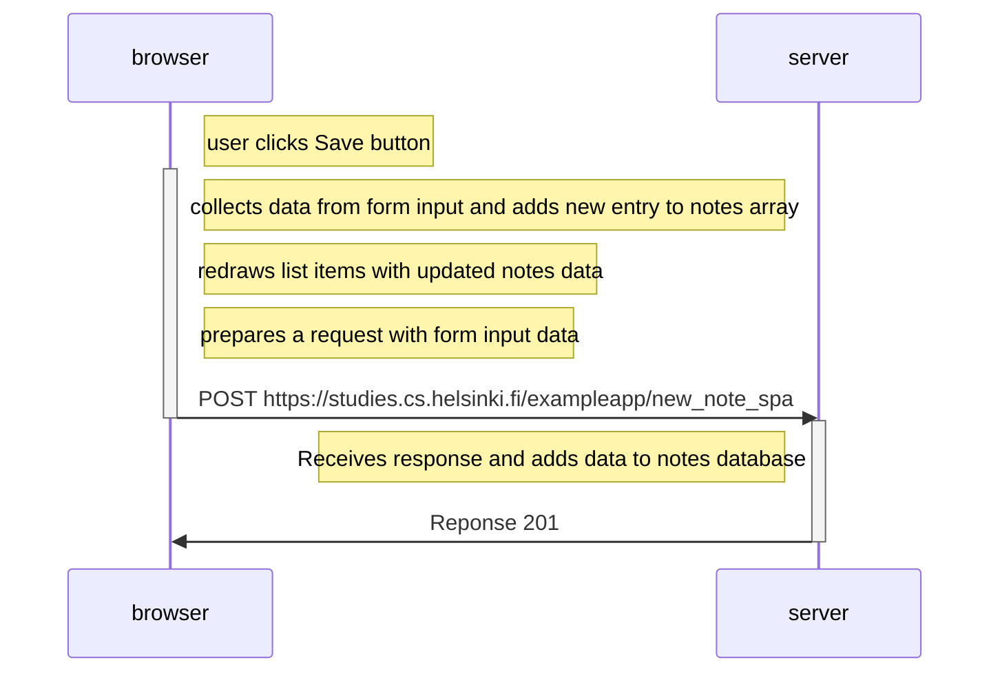

```mermaid

sequenceDiagram
    participant browser
    participant server

    Note right of browser: user clicks Save button

    activate browser
    Note right of browser: collects data from form input and adds new entry to notes array
    Note right of browser: redraws list items with updated notes data
    Note right of browser: prepares a request with form input data
    browser->>server: POST https://studies.cs.helsinki.fi/exampleapp/new_note_spa
    deactivate browser

    activate server
    Note left of server: Receives response and adds data to notes database
    server->>browser: Reponse 201
    deactivate server

```